# Hi, I'm ansariaiadmin 👋 — Full-Stack & AI Engineer | Open to Freelance Work

I build **production-grade, self-hosted SaaS platforms** with real-world hardening: one-command deploys, backup/restore with S3, Persian NLP, multi-agent AI, trading risk engines, and WordPress factories. **Stdlib-only where it matters, explicit fallbacks where it doesn't — no fake success, no secrets, no Aurora.**

**Stack:** Python (FastAPI, Pydantic, SQLAlchemy) • TypeScript (NestJS, Next.js 15, Drizzle, pgvector) • PHP 8.1+ (WPCS, HPOS) • Docker, PostgreSQL, Redis, Ollama, Prometheus • **Non-Technical Ready:** `install.sh` + `update.sh` + `docs/USER_GUIDE_FA.md`

**Open to freelance work:** SaaS MVPs, AI integration (RAG, agents), trading systems, WordPress at scale, production hardening. DM or email.

**Fleet Status:** 8 repos • 10/10 Technical Quality • 7.8/10 Product Value Avg • All Public • v1.0.1/v0.9.1 Non-Technical Edition

---

## 🚀 Featured Projects — Portfolio (8 Production-Grade)

| # | Project | What it is | Product Value /10 | Tech Highlights | License | Link | Install |
|---|---------|------------|-------------------|-----------------|---------|------|---------|
| 1 | **AiWp** | WordPress Plugin Factory — spec-driven scaffold that turns 30-line JSON into production-grade plugins + SaaS license platform | **8.5/10** | PHP 8.1+, WPCS 3.x 0 errors, HPOS-safe Woo, Action Scheduler, Next.js 16 + Drizzle, license API, 31 tests, docker php:8.2-cli | MIT | [aiwp](https://github.com/ansariaiadmin/aiwp) | `./install.sh` |
| 2 | **AARK Kernel** | Enterprise Financial Trading Platform — multi-agent AI, real trading (Nobitex), paper trading, advanced risk | **8.0/10** | FastAPI, multi-model router Ollama/OpenAI/Anthropic/Groq, VaR/CVaR/stress/correlation + backtest Kupiec POF, JWT+RBAC, WebSocket pub/sub, 54 tests, Prometheus | MIT | [aark-kernel](https://github.com/ansariaiadmin/aark-kernel) | `./install.sh` |
| 3 | **Legal Platform** | Self-hosted Legal Practice OS for Iranian lawyers — website CMS, booking, CRM, wallet, AI workspace with 6 agents | **9.0/10** | NestJS + Next.js 15 + PG16 pgvector + Redis, Persian NLP 29 tests, RAG tri-hybrid + RRF, backup/restore S3, 476 tests, one-command Persian wizard | AGPL-3.0 | [legal-platform](https://github.com/ansariaiadmin/legal-platform) | `./install.sh` |
| 4 | **ForgeOps** | DevOps Control Plane — projects, agents, docs, memory, RAG, health, Docker services | **7.5/10** | Next.js 15 + Prisma, hybrid RAG 0.4+0.6, health weighted score, dockerode graceful fallback, RBAC 8 e2e, treasury AURORA unreachable 503, 91 tests | MIT | [forgeops](https://github.com/ansariaiadmin/forgeops) | `./install.sh` |
| 5 | **PROJECT_ROBOTS** | Level 5 Autonomous Software Engineer — stdlib-only, speculative execution, reflexion | **7.0/10** | Python 3.11 stdlib-only, 6 robots intelligence/impact/evidence/reflexion/autonomous/protocol, 181 tests, persistent learning store, evidence packs ADR | MIT | [project-robots](https://github.com/ansariaiadmin/project-robots) | `pip install -e .` |
| 6 | **EAOS** | Enterprise Agent OS (Local-First) — finance core, LLM router, voice, Temporal, legal RAG | **7.5/10** | FastAPI + React Flow DAG, deterministic finance, hybrid LLM router redaction, voice pipeline, Temporal workflows, orchestration planner/executor/critic, 42 tests | MIT | [eaos](https://github.com/ansariaiadmin/eaos) | `./install.sh` |
| 7 | **Adaptive Financial OS** | Double-Entry Ledger + Event Sourcing — RLS, immutability, outbox | **7.0/10** | NestJS modular monolith + PG16 RLS + triggers, idempotency guard before upsert + regression test, transactional outbox HTTP, projection 0002 + RLS, 34 tests | MIT | [adaptive-financial-os](https://github.com/ansariaiadmin/adaptive-financial-os) | `./install.sh` |
| 8 | **Universal Document OS** | Local App + Landing — document processing PDF/DOCX/XLSX/PPTX/ODT | **8.0/10** | FastAPI + Adapter Registry, 15 formats, workrooms, audit log, health, static prod + Jinja2 cache clean, 19 tests, local-first no secrets | MIT | [universal-document-os](https://github.com/ansariaiadmin/universal-document-os) | `./install.sh` |

**All 8:** `install.sh` (clean install) + `update.sh` (clean update with backup) + `docs/USER_GUIDE_FA.md` (Persian complete training) + `INSTALL.md` + Docker healthy + linter 0 + security 0

---

### 📊 Quick Stats — Fleet 10/10 Technical + 7.8/10 Product

```
AiWp:              31 tests (25 factory +6 e2e HOSTNAME 0.0.0.0 Origin), PHP 8.2-cli docker, 0 WPCS, build/zip factory, 8.5/10 product
AARK Kernel:       54 tests (39 risk+paper +7 v22 zero env +8 var_backtest+ws), VaR 95% $100K, Crypto Winter -70%, 8.0/10 product
Legal Platform:    476 tests (67 suites), secret-scan 0, one-command Persian wizard, backup S3 offsite, 9.0/10 product
ForgeOps:          91 tests (83+8 RBAC e2e), dockerode graceful fallback, treasury AURORA 503 real path, 7.5/10 product
PROJECT_ROBOTS:    181 tests, 266 utcnow->now(UTC) fixed, stdlib-only, persistent learning, 7.0/10 product
EAOS:              42 tests (39+3 e2e orchestration mock LLM), vector_store lite 64-dim, 2 utcnow fixed, 7.5/10 product
Adaptive Financial OS: 34 tests, idempotency guard before upsert + regression, 0002_projection.sql + RLS, 7.0/10 product
Universal Document OS: 19 tests, 15 formats adapter registry, static prod + Jinja2 cache clean, 8.0/10 product
Fleet Avg:         10/10 technical (linter 0, tests green, docker healthy, security 0, docs badge+mermaid+quickstart) + 7.8/10 product
```

**Build Badges:**
- [](https://github.com/ansariaiadmin/aiwp/actions) AiWp
- [](https://github.com/ansariaiadmin/aark-kernel/actions) AARK
- [](https://github.com/ansariaiadmin/legal-platform/actions) Legal
- [](https://github.com/ansariaiadmin/forgeops/actions) ForgeOps
- [](https://github.com/ansariaiadmin/project-robots/actions) Robots
- [](https://github.com/ansariaiadmin/eaos/actions) EAOS
- [](https://github.com/ansariaiadmin/adaptive-financial-os/actions) Adaptive
- [](https://github.com/ansariaiadmin/universal-document-os/actions) Universal

---

### 🧪 Product Evaluation — ارزش محصولی از ۱۰ (Honest)

| Project | Product Value /10 | Why | Strengths | To Reach 10/10 |
|---------|-------------------|-----|-----------|----------------|
| **AiWp** | **8.5/10** | Solves real WP agency pain: spec→plugin factory + SaaS license platform. WPCS 0, HPOS-safe, Action Scheduler, Next.js 16 + Drizzle, 31 tests, docker php:8.2-cli. | Factory thinking, security mastery, full-stack SaaS, one-command install, non-technical guide | Visual spec builder drag-drop, marketplace sync wp.org, multi-tenant SaaS, AI code review |
| **AARK Kernel** | **8.0/10** | Real trading engine Nobitex (not toy), paper trading slippage 0.1-0.3%, VaR/CVaR/stress/correlation + backtest Kupiec POF, multi-model AI router, JWT+RBAC, WebSocket, Prometheus. | Real exchange integration, advanced risk, enterprise security, 54 tests, docker healthy | Better UI (TradingView LineChart real, currently iframe), order book depth, ML risk prediction, multi-exchange |
| **Legal Platform** | **9.0/10** | Best product-market fit: self-hosted Legal OS for Iranian lawyers, Persian UI, CMS, booking, CRM timeline, wallet, AI workspace 6 agents, RAG tri-hybrid + RRF, law monitor, backup S3 offsite encryption, audit logs, one-command Persian wizard, 476 tests, secret-scan 0. | Regulated market SaaS, Persian NLP 29 tests, zero-support design, production hardening | Mobile app, e-signature, court API integration, AI judge prediction, voice transcription |
| **ForgeOps** | **7.5/10** | DevOps control plane: projects, agents, docs, memory, RAG hybrid 0.4+0.6, health weighted score, dockerode graceful fallback, RBAC 8 e2e, treasury AURORA 503 real path, 91 tests. Good internal tool. | Hybrid search, health scoring, RBAC, docker integration, prod drill clean env | JWT refresh rotation, Temporal/BullMQ real execution, pgvector prod, Docker logs WebSocket streaming, GitHub App |
| **PROJECT_ROBOTS** | **7.0/10** | Level 5 Autonomous Engineer, stdlib-only, 6 robots, 181 tests, 266 utcnow fixed, persistent learning store, evidence packs ADR/observability/package/rollback. Interesting for devs, CLI only. | Stdlib-only, speculative execution, reflexion loops, continuous learning, 181 tests | Multi-repo orchestration, LLM-based planning (currently rule-based), real-time file watcher, self-healing CI, web UI |
| **EAOS** | **7.5/10** | Enterprise Agent OS: deterministic finance core, hybrid LLM router redaction, voice pipeline, Temporal workflows, legal RAG vector+lexical, trading guardrails, tax adapters, orchestration planner/executor/critic, React Flow DAG, 42 tests. | Finance determinism, hybrid router, orchestration, vector_store lite, local-first | Phases 13-16 (real embeddings pgvector, Temporal prod, voice STT/TTS real Whisper, trading live), real LLM prod keys, multi-tenant |
| **Adaptive Financial OS** | **7.0/10** | Double-entry ledger + event sourcing: RLS, immutability triggers, idempotency guard before upsert + regression test, transactional outbox HTTP, projection 0002 + RLS, endpoints /ledger/projection + /balances, 34 tests. Strong backend, no real UI. | Double-entry correctness, RLS, idempotency, outbox pattern, projection, 34 tests | Kafka publisher (currently HTTP), event replay + snapshots, multi-currency FX real-time, GraphQL API, web UI |
| **Universal Document OS** | **8.0/10** | Local-first document OS: upload multipart, format detect 15 formats, adapter registry PDF/DOCX/XLSX/PPTX/ODT/TXT/MD/CSV/JSON/HTML/RTF, workrooms, audit log, health, landing + panel, static prod + Jinja2 cache clean, 19 tests, no secrets. Simple but works, drag-drop. | Local-first, adapter registry, 15 formats, workrooms, audit, no login, 19 tests | OCR multi-engine (Tesseract, PaddleOCR), translation, layout reconstruction (tables, headers), Golden Benchmark per Society |

**Fleet Average Product Value: 7.8/10**

**Technical Quality: 10/10 for all 8** (tests green, linter 0, docker healthy with healthcheck, security 0, .env.example complete, docs badge+mermaid+quickstart+sample, CI lint+test+build, release tags + GitHub Releases, HANDOFF + AGENTS, honest scope v2 explicit)

**To reach 10/10 product for all:** Need visual builders for non-technical, better UI (TradingView real charts, mobile apps), real-time features (order book, logs streaming), and market-specific integrations (court API, e-signature, multi-exchange, OCR multi-engine). See ROADMAP.md Done vs v2 per repo.

---

### 🚀 Non-Technical Quick Start — نصب در ۱ دقیقه برای افراد غیر فنی

**هر ریپو فقط یک دستور:**

```bash
git clone https://github.com/ansariaiadmin/<repo>.git
cd <repo>
chmod +x install.sh
./install.sh
# بعد مرورگر را باز کن — تمام!
```

**مثال:**
```bash
git clone https://github.com/ansariaiadmin/universal-document-os.git
cd universal-document-os
./install.sh
# http://localhost:8000/app → Drag & Drop PDF → Analyze → Done!
```

**دستورات ساده روزانه:**
- `./install.sh` — نصب خودکار تمیز (چک Docker، ساخت .env با رمز تصادفی، docker compose up --build -d)
- `./update.sh` — آپدیت خودکار تمیز (بکاپ به backups/ + git pull + rebuild + health check)
- `./start.sh` — شروع
- `./stop.sh` — توقف
- `./status.sh` — وضعیت + سلامت
- `./logs.sh` — لاگ‌ها
- `./backup.sh` — بکاپ

**ویندوز:** `install.bat`, `update.bat`, etc. — دوبار کلیک!

**آموزش کامل:** هر ریپو `INSTALL.md` + `docs/USER_GUIDE_FA.md` (فارسی ۳۰۰+ خط) + `docs/USER_GUIDE_EN.md`

**Fleet — نصب همه ۸ تا:**
```bash
git clone https://github.com/ansariaiadmin/ansariaiadmin.git
cd ansariaiadmin
# یا از ~/pub/install-all.sh
for repo in aiwp aark-kernel legal-platform forgeops project-robots eaos adaptive-financial-os universal-document-os; do
  git clone https://github.com/ansariaiadmin/$repo.git
  cd $repo && ./install.sh && cd ..
done
```

---

### 🔧 How These Repos Are Built — Architecture Fleet

```mermaid
flowchart TB
    subgraph AiWp
        Spec[JSON Spec 30 lines] --> Factory[Factory]
        Factory --> Plugin[WP Plugin Zip]
        Factory --> Platform[License SaaS Next.js]
    end

    subgraph AARK
        API[FastAPI] --> Brain[AI Brain Memory+Streaming]
        Brain --> Router[Multi-Model Router Ollama/OpenAI/Anthropic/Groq]
        Router --> Tools[13 Tools]
        Tools --> Trading[Nobitex Real + Paper]
        Trading --> Risk[Risk VaR/CVaR/Stress/Correlation + Backtest]
        Risk --> WS[WebSocket Pub/Sub]
    end

    subgraph Legal
        Proxy[Nginx 8080] --> Web[Next.js 15]
        Proxy --> API2[NestJS]
        API2 --> RAG[RAG Tri-Hybrid + RRF + 6 Agents]
        API2 --> CRM[CRM Timeline + Wallet]
        API2 --> Backup[Backup S3 Offsite + Audit]
    end

    subgraph ForgeOps
        User[User] --> NextAuth[NextAuth]
        NextAuth --> AppRouter[App Router]
        AppRouter --> Prisma[Prisma SQLite/Postgres]
        Prisma --> RAG2[Hybrid RAG 0.4+0.6]
        RAG2 --> Docker[Dockerode Graceful Fallback]
    end

    subgraph Robots
        CLI[CLI] --> Discover[Discover Stack]
        Discover --> Intel[Intelligence Coupling]
        Intel --> Plan[Plan]
        Plan --> Check[Check --run]
        Check --> Evidence[Evidence ADR]
        Evidence --> Reflexion[Reflexion Loop]
        Reflexion --> Learning[Learning Persistent Store]
    end

    subgraph EAOS
        Web2[React Flow DAG] --> API3[FastAPI]
        API3 --> Orch[Orchestrator Planner->Executor->Critic]
        Orch --> Legal2[Legal Vector Lite 64-dim]
        Orch --> Finance[Finance Deterministic]
        Orch --> Voice[Voice Pipeline]
    end

    subgraph Adaptive
        Client[Client] --> API4[NestJS API]
        API4 --> Ledger[Ledger Posting]
        Ledger --> Guard[Idempotency Guard Before Upsert]
        Guard --> DB[(Postgres RLS)]
        DB --> Outbox[Outbox]
        Outbox --> Webhook[Webhook HTTP]
        DB --> Projection[Projection + Balances]
    end

    subgraph Universal
        Landing[Landing /] --> Panel[Panel /app]
        Panel --> Upload[Upload Multipart]
        Upload --> Registry[Adapter Registry 15 formats]
        Registry --> Workroom[Workroom + Audit]
    end
```



---

### 🛠 What I Prove With These — برای کارفرماهای فریلنس

- **Factory thinking:** Turn repetitive work into spec-driven generators (AiWp) — ship new products without editing scaffold. Demonstrates architecture for rapid product factories.
- **Real trading & risk:** Not toy bots — real exchange integration (Nobitex), slippage modeling 0.1-0.3%, VaR/CVaR, stress testing 6 scenarios (crash, crypto winter), HHI concentration, Kupiec POF backtest.
- **Self-hosted SaaS for regulated markets:** One-command installer with Persian wizard, backup/restore with hard-confirm + audit, S3 offsite, zero-support design, 476 tests, secret-scan 0 (Legal Platform).
- **DevOps control plane:** Projects, agents, docs, memory, RAG hybrid, health weighted score, dockerode graceful fallback, RBAC 8 e2e, treasury AURORA 503 real path (ForgeOps).
- **Autonomous engineering:** Stdlib-only, speculative execution, reflexion loops, continuous learning, persistent store, evidence packs (PROJECT_ROBOTS).
- **Enterprise Agent OS:** Deterministic finance core, hybrid LLM router redaction, voice pipeline, Temporal workflows, legal RAG, trading guardrails, tax adapters, orchestration planner/executor/critic, React Flow DAG (EAOS).
- **Financial correctness:** Double-entry ledger with RLS, immutability triggers, idempotency guard before upsert + regression test, transactional outbox, projection + RLS, WebhookOutboxPublisher HTTP (Adaptive Financial OS).
- **Local-first document OS:** Upload, detect 15 formats, adapter registry, workrooms, audit log, health, static prod + Jinja2 cache clean, no secrets, drag-drop (Universal Document OS).

---

### 🌱 Coming Soon — New Projects (جا برای پروژه‌های جدید)

This fleet is **8 repos, all public, 10/10 technical, 7.8/10 product avg, v1.0.1/v0.9.1 non-technical edition**. When these are done, new projects will be added here.

**Reserved slots for new projects:**

| # | Project | Status | Description | Planned Tech |
|---|---------|--------|-------------|--------------|
| 9 | **Coming Soon** | 🔜 Planned | New SaaS — idea? AI + Persian market? | TBD |
| 10 | **Coming Soon** | 🔜 Planned | New Trading — multi-exchange, ML risk? | TBD |
| 11 | **Coming Soon** | 🔜 Planned | New Legal — mobile app, e-signature, court API? | TBD |
| 12 | **Coming Soon** | 🔜 Planned | New DevOps — GitHub App, logs streaming WebSocket? | TBD |
| 13 | **Coming Soon** | 🔜 Planned | New Document — OCR multi-engine, translation, layout? | TBD |
| 14 | **Coming Soon** | 🔜 Planned | New Financial — Kafka, event replay, FX real-time, GraphQL? | TBD |

**How to add new project:**
1. Build with same standards: tests green, linter 0, docker healthy with healthcheck, .env.example complete, docs badge+mermaid+quickstart+sample, CI, release tags, HANDOFF, honest scope v2, non-technical `install.sh` + `update.sh` + `docs/USER_GUIDE_FA.md`
2. Push to `ansariaiadmin/<new-repo>` with PAT, make public
3. Add to this README table + Quick Stats + Product Evaluation + Architecture mermaid
4. Update `FLEET_NON_TECHNICAL_GUIDE.md` and `install-all.sh`

**Want to propose a new project?** Open an issue or DM.

---

### 📫 Contact — ارتباط

- **GitHub:** [@ansariaiadmin](https://github.com/ansariaiadmin)
- **Portfolio:** This profile + 8 repos above (all public now, except errors none, so all public per request)
- **Status:** **Open to freelance work** — SaaS MVPs, AI integration (RAG, agents), trading systems, WordPress at scale, production hardening, Persian market SaaS
- **Email:** Check profile or DM on GitHub
- **Docs:** Each repo has `INSTALL.md` + `docs/USER_GUIDE_FA.md` (Persian) + `docs/USER_GUIDE_EN.md` + `README.md` with non-technical section + `AGENTS.md` + `ROADMAP.md` Done vs v2 + `CHANGELOG.md`

---

### 📦 Installation — Fleet One-Liners

**For non-technical (هر ریپو):**
```bash
git clone https://github.com/ansariaiadmin/<repo>.git
cd <repo>
./install.sh
# Open browser to URL shown — Done!
```

**For developers (fleet):**
```bash
mkdir fleet && cd fleet
for repo in aiwp aark-kernel legal-platform forgeops project-robots eaos adaptive-financial-os universal-document-os; do
  git clone https://github.com/ansariaiadmin/$repo.git
  cd $repo && ./install.sh && cd .. || true
done
```

**Update all:**
```bash
for d in */; do cd $d && ./update.sh && cd ..; done
```

**Versions:**
- `v1.0.0 / v0.9.0` — 10/10 technical final (REPORT-8)
- `v1.0.1 / v0.9.1` — Non-technical auto install + auto update + complete training (REPORT-9) — **Current recommended for non-technical**

---

> ✅ **All 8 repos are now public** (previously 3 public + 5 private, now 8 public per request "بجز ارورا بقیه رو پابلیک کن" — no errors found, so all public). No secrets, no Aurora in public repos, secret-scan 0, .env.example complete, linter 0, tests green, docker healthy.

**End of Profile — Fleet 8 repos, 10/10 technical, 7.8/10 product avg, all public, v1.0.1/v0.9.1 non-technical edition, ready for new projects.**

