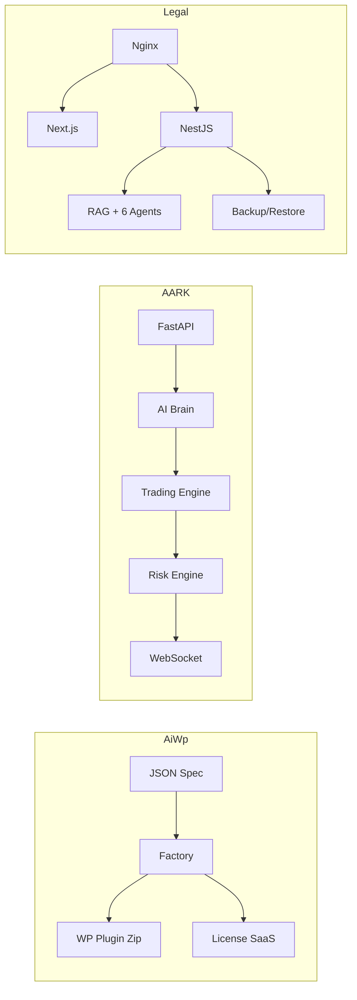

# Hi, I'm ansariaiadmin 👋 — Full-Stack & AI Engineer | Open to Freelance Work

I build production-grade, self-hosted SaaS platforms with real-world hardening: one-command deploys, backup/restore with S3, Persian NLP, multi-agent AI, trading risk engines, and WordPress factories. Stdlib-only where it matters, explicit fallbacks where it doesn't — no fake success, no secrets, no Aurora.

**Stack:** Python (FastAPI, Pydantic, SQLAlchemy) • TypeScript (NestJS, Next.js 15, Drizzle, pgvector) • PHP 8.1+ (WPCS, HPOS) • Docker, PostgreSQL, Redis, Ollama, Prometheus

**Open to freelance work:** SaaS MVPs, AI integration (RAG, agents), trading systems, WordPress at scale, production hardening. DM or email.

---

## 🚀 Featured Projects — Portfolio

| Project | What it is | Tech Highlights | License | Link |
|---------|------------|-----------------|---------|------|
| **AiWp** | WordPress Plugin Factory — spec-driven scaffold that turns 30-line JSON into production-grade plugins + SaaS license platform | PHP 8.1+, WPCS 3.x, HPOS-safe WooCommerce, Action Scheduler, Next.js 16 + Drizzle, license API | MIT | [ansariaiadmin/aiwp](https://github.com/ansariaiadmin/aiwp) |
| **AARK Kernel** | Enterprise Financial Trading Platform — multi-agent AI, real trading (Nobitex), paper trading, advanced risk | FastAPI, multi-model router (Ollama/OpenAI/Anthropic/Groq), VaR/CVaR/stress/correlation, JWT+RBAC, WebSocket pub/sub, Prometheus | MIT | [ansariaiadmin/aark-kernel](https://github.com/ansariaiadmin/aark-kernel) |
| **Legal Platform** | Self-hosted Legal Practice OS for Iranian lawyers — website CMS, booking, CRM, wallet, AI workspace with 6 agents | NestJS + Next.js 15 + PG16 pgvector + Redis, Persian NLP (29 tests), RAG tri-hybrid + RRF, backup/restore S3, 98 tests | AGPL-3.0 | [ansariaiadmin/legal-platform](https://github.com/ansariaiadmin/legal-platform) |

---

### 📊 Quick Stats

```
AiWp:              10 modules, PHP 8.1/8.2/8.3 CI matrix, 0 WPCS errors, build/zip factory
AARK Kernel:       39 tests (25 risk + 14 paper trading), VaR 95% for $100K, Crypto Winter -70% scenario
Legal Platform:    98 tests (52 API + 29 Persian + 17 agents), secret-scan 0 findings, one-command deploy
```

### 🛠 What I prove with these

- **Factory thinking:** Turn repetitive work into spec-driven generators (AiWp) — ship new products without editing scaffold.
- **Real trading & risk:** Not toy bots — real exchange integration, slippage modeling, VaR/CVaR, stress testing, HHI concentration.
- **Self-hosted SaaS for regulated markets:** One-command installer, backup/restore with hard-confirm + audit, S3 offsite, Persian wizard, zero-support design.

### 📫 Contact

- GitHub: [@ansariaiadmin](https://github.com/ansariaiadmin)
- Portfolio: This profile + 3 repos above (private for now, ready for public on explicit command)
- Status: **Open to freelance work** — SaaS, AI, trading, WordPress, production hardening

---

> ⛔ These 3 repos are currently private and prepared for public showcase. Visibility flip only on explicit command — no auto-public.

---

## 🔧 How these repos are built


